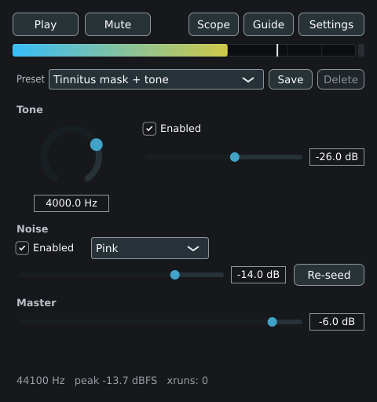
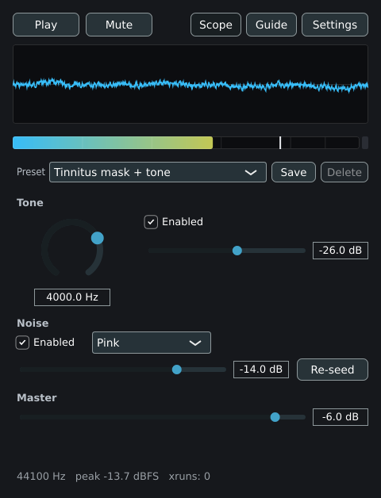
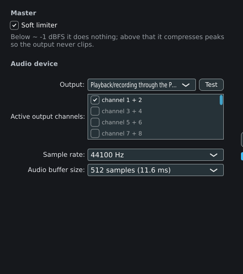

# Noisefield

[](https://github.com/blasoliva/noisefield/actions/workflows/ci.yml)
[](https://github.com/blasoliva/noisefield/releases)
[](LICENSE)


A native Linux desktop app to generate tones across a frequency range and mix different
types of noise (white, pink, brown, blue, violet, grey) into layered sound fields. The
[user guide](docs/guide.md) explains what each control does.

I have tinnitus. Playing certain tones and noise blends through this app relieves the
sensation for me at times — that is why it exists. This app is a personal tool, not a
medical device.

Noisefield is built 100% AI-assisted.

> Status: **M2 done, M3 in progress.** Tone + six noise colours + mixer + soft-limited master,
> a dBFS meter, a collapsible oscilloscope, factory and user presets, and a VST3/LV2/CLAP
> plugin. See [`docs/plan.md`](docs/plan.md) for the full plan and
> [`docs/backlog.md`](docs/backlog.md) for tasks.

## Download

Pre-built Linux x86_64 artefacts are on the
[Releases page](https://github.com/blasoliva/noisefield/releases): an **AppImage**
(`chmod +x` and run — no install), a **`.deb`** for Debian/Ubuntu, and a **`.tar.gz`** with
the VST3 / LV2 / CLAP plugins. To build from source instead, see below.

## Screenshots

<p align="center">
  <br>
  <em>Main window: transport, the preset menu (factory + saved presets), the tone source
  (frequency knob with Hz entry, and level), the noise source (colour and level), the master
  level, and the dBFS output meter.</em>
</p>

<p align="center">
  <br>
  <em>The Scope button expands a master-output oscilloscope in place, aligned to a rising
  zero-crossing; the window resizes to fit.</em>
</p>

<p align="center">
  <br>
  <em>Settings window: the master soft limiter, plus the audio-device selector — output
  device, active channels, sample rate and buffer size.</em>
</p>

A built-in **Guide** window (also at [`docs/guide.md`](docs/guide.md)) explains every control.

## Tech stack

- **C++20** + **[JUCE 8](https://juce.com/)** (fetched automatically by CMake)
- **CMake ≥ 3.22** build
- Linux audio via **ALSA** (native) and **JACK** (optional at runtime); PipeWire-compatible
- Tests with **Catch2 v3**
- Optional **VST3 / LV2 / CLAP** plugin from the same engine (`-DNOISEFIELD_BUILD_PLUGIN=ON`)

## Building

See [`docs/building.md`](docs/building.md) for the full list of system dependencies.

```sh
# Debian/Ubuntu system dependencies
sudo apt install build-essential cmake pkg-config \
  libasound2-dev libjack-jackd2-dev libfreetype6-dev libfontconfig1-dev \
  libx11-dev libxext-dev libxrandr-dev libxinerama-dev libxcursor-dev \
  libgl1-mesa-dev libcurl4-openssl-dev

# Configure and build
cmake -B build -DCMAKE_BUILD_TYPE=Release
cmake --build build

# Run
./build/src/Noisefield_artefacts/Release/Noisefield

# Tests
cmake -B build -DNOISEFIELD_BUILD_TESTS=ON
cmake --build build
ctest --test-dir build --output-on-failure

# Plugin (VST3 / LV2 / CLAP) -> build/src/plugin/NoisefieldPlugin_artefacts/
cmake -B build -DNOISEFIELD_BUILD_PLUGIN=ON
cmake --build build
```

CI (GitHub Actions) builds and runs the test suite on Ubuntu and checks `clang-format` on
every push and pull request.

## Repository layout

| Path | Purpose |
|---|---|
| `src/app/` | Application entry point and main window |
| `src/engine/` | Real-time audio engine, graph, mixer, master bus |
| `src/dsp/` | Oscillators, noise generators, filters, modulators |
| `src/model/` | Project/Layer data model and JSON serialization |
| `src/gui/` | GUI components |
| `src/io/` | Recorder, exporter, headless CLI |
| `tests/` | Catch2 tests |
| `cmake/` | Build helpers (JUCE fetch) |
| `resources/` | Icons, factory presets, `.desktop` file |
| `packaging/` | AppImage / Flatpak packaging |

## License

[GPL-3.0-or-later](LICENSE). This choice keeps the project compatible with JUCE 8's
open-source (AGPL/GPL) licensing terms; revisit if a commercial JUCE license is acquired.
