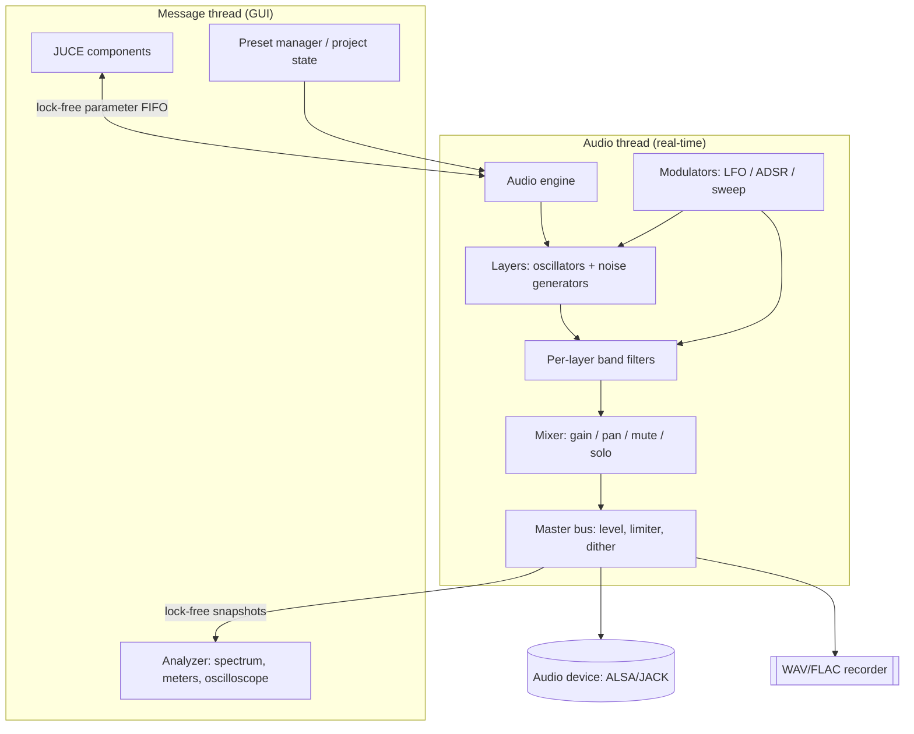

# Noisefield — Development Plan

## 1. Vision

Noisefield is a native Linux desktop application with a graphical interface that lets you:

- Generate tones across a configurable frequency range (20 Hz – 20 kHz).
- Generate and mix different types of noise (white, pink, brown, blue, violet, grey).
- Combine tones and noise in layers, with per-layer level, panning, and band filtering.

**Core use case:** generate a frequency and mix it with other sources to build sound
"fields" — from audio testing and listening exercises to sound masking, focus, relaxation,
and sound design.

## 2. Technology Decision

### 2.1 Requirements driving the decision

1. Real-time audio, low latency, no clicks or glitches.
2. Smooth native GUI on Linux (X11/Wayland), with HiDPI scaling.
3. Efficient DSP (several generators + filters running at once).
4. Packaged as a distributable native application (AppImage/Flatpak).
5. Room to grow: effects, spectral analysis, recording, and possibly a plugin version.
6. A maintainable, tested codebase.

### 2.2 Options evaluated

| Criterion | JUCE + C++ | Python (PySide6 + sounddevice + numpy) | Rust (cpal + fundsp + egui) |
|---|---|---|---|
| Real-time audio | Excellent (purpose-built) | Risky: GIL and GC pauses cause glitches under load | Very good |
| Built-in DSP | `juce::dsp` module (filters, FFT, oscillators) | numpy/scipy (not RT-safe) | `fundsp` (good, younger) |
| Native GUI | Yes, own framework integrated with audio | Yes (Qt), but manual audio↔GUI bridge | egui/iced (immature for complex apps) |
| Linux backends | ALSA, JACK, PipeWire (via ALSA/JACK) | PortAudio | ALSA/JACK via cpal |
| Native packaging | Straightforward AppImage/deb/Flatpak | Fragile (interpreter + native libs) | Good |
| Path to plugin (LV2/CLAP/VST3) | Direct from the same code | Not viable | Possible (nih-plug/clap) |
| Learning curve | Medium-high (C++) | Low | High |
| Audio ecosystem / examples | Very large | Medium | Small |

### 2.3 Decision: **JUCE 8 + C++20, with CMake**

Rationale:

- It is the de facto standard for audio applications and is built for exactly this problem:
  a real-time audio thread + GUI + DSP in a single framework.
- The `juce::dsp` module covers oscillators, filters (SVF/IIR/FIR), FFT, and mixing utilities.
- A single codebase produces the *standalone* app and, later, an LV2/CLAP plugin.
- Mature Linux packaging.

**Optional rapid-prototyping alternative:** to validate sound ideas before writing C++, a
Python script or notebook with `numpy` + `sounddevice` is fine for prototyping the noise and
filtering algorithms *offline*. It is not the final app; it is ruled out for the product for
the reasons in the table.

### 2.4 Concrete stack

- **Language:** C++20.
- **Framework:** JUCE 8 — modules `juce_audio_basics`, `juce_audio_devices`,
  `juce_audio_utils`, `juce_audio_formats`, `juce_dsp`, `juce_gui_basics`, `juce_gui_extra`.
- **Build:** CMake ≥ 3.22, JUCE via `FetchContent` (pinned to a version/tag).
- **Linux audio:** ALSA (native), JACK (optional at runtime), PipeWire-compatible through its
  ALSA/JACK layers.
- **Tests:** Catch2 v3 for DSP and logic; offline *render* tests comparing
  buffers/spectra against references.
- **Quality:** `clang-format`, `clang-tidy`, warnings as errors.
- **CI:** GitHub Actions — build + tests on Ubuntu LTS.
- **Packaging:** AppImage (`linuxdeploy`) as the primary format; Flatpak as a secondary
  target; `.deb` optional.
- **System build dependencies:** `build-essential cmake pkg-config libasound2-dev
  libjack-jackd2-dev libfreetype6-dev libfontconfig1-dev libx11-dev libxext-dev
  libxrandr-dev libxinerama-dev libxcursor-dev libgl1-mesa-dev libcurl4-openssl-dev`.

## 3. Architecture



Principles:

- **Audio-thread rule:** no `malloc`/`free`, no locks, no I/O, no exceptions in the audio
  *callback*.
- GUI→audio communication via `std::atomic` (`engine::EngineParameters`); audio→GUI via a
  lock-free peak-hold atomic (meter) and an SPSC ring (`dsp::ScopeBuffer`, oscilloscope).
- Smoothing of every audible parameter (`dsp::ParamSmoother`) to avoid clicks.
- The whole real-time signal path lives in **`engine::SignalGraph`**, host-agnostic and
  GUI-free. The standalone app drives it through `engine::AudioEngine` (a thin
  `AudioIODeviceCallback` + `AudioDeviceManager` wrapper); the plugin
  (`plugin::NoisefieldAudioProcessor`, VST3/LV2/CLAP) drives the same graph from
  `processBlock`, mirroring its `AudioProcessorValueTreeState` into the parameter block.

### 3.1 Data model

- **Project** = ordered list of **Layers** + master bus settings + session settings
  (timer, fades).
- **Layer:**
  - `type`: `oscillator` | `noise`
  - Oscillator: `shape` (sine/triangle/square/saw), `frequency`, `finetune`, `phase`
  - Noise: `color` (white/pink/brown/blue/violet/grey), `seed`
  - Band filter: `mode` (lowpass/highpass/bandpass/notch/off), `cutoff frequency`, `Q`
  - Mix: `gain`, `pan`, `mute`, `solo`
  - Modulation: assignments {source → destination, amount}
- Serialization: JSON (`juce::var` or `nlohmann::json`), with a schema version number.

## 4. Core functionality (MVP)

1. Audio output to the selected device (ALSA/JACK), with device, *sample rate*, and buffer
   size selection.
2. **One oscillator** (sine) with adjustable frequency (20 Hz–20 kHz) via slider and via an
   editable numeric field in Hz.
3. **One noise generator** (white at minimum).
4. **Mixing** the frequency and the noise: independent level per source + master level + mute.
5. Minimal transport: play / stop.
6. Protection: gain and frequency smoothing, soft limiter on the master.

**MVP acceptance criterion:** you can open the app, pick a device, set a tone to an exact
frequency, add white noise, adjust the mix of the two, and hear the result with no clicks for
≥ 10 min.

## 5. Possible features (prioritized roadmap)

**"Field" core (high priority):**

- Full noise types: white, pink, brown, blue, violet, grey (psychoacoustically weighted).
- Band-limited noise: State Variable filter (bandpass) with cutoff and Q → the "noisefield"
  proper.
- Multiple layers with a mixer (gain, pan, mute, solo) and an arbitrary layer count.
- Presets: save/load as JSON, factory presets, A/B comparison.

**Synthesis and modulation (medium):**

- Additional waveforms with anti-aliasing (PolyBLEP or wavetables).
- Multiple oscillators; detune/beating between oscillators.
- Frequency sweep (linear/exponential), glissando.
- LFO (per-layer and global), ADSR envelope, fade in/out.
- Modulation matrix (source→destination with amount).

**Tools (medium):**

- Spectrum analyzer (FFT), RMS/peak meters with hold, oscilloscope.
- Recording to WAV/FLAC and fixed-duration export (offline render faster than real time).
- Session timer: play for X minutes with auto fade in/out; scheduled shutdown.
- Stereo width / noise decorrelation between channels.

**Integration and distribution (medium-low):**

- Explicit JACK support and port reconnection.
- CLI / headless mode to generate files without the GUI.
- AppImage + Flatpak; version updates.
- Accessibility: keyboard navigation, labels, high contrast.

**Long term / icebox:**

- Plugin version LV2 / CLAP / VST3 from the same code.
- MIDI input (play the oscillator from a keyboard, map CC to parameters).
- Use-case presets: tinnitus masking, focus, sleep.
- Timeline automation.
- Internationalization (ES/EN).

## 6. DSP design

- **PRNG:** `xoshiro256++`, seedable per layer (fast, good quality for audio).
- **Noise colours:** one white source (`dsp::WhiteNoise`) tinted by `dsp::NoiseTint` — see the
  table below.
- **Oscillator:** direct sine (`std::sin` or a polynomial approximation); other shapes with
  PolyBLEP to limit aliasing.
- **Band filter:** topology-preserving SVF (Zavalishin/TPT) with LP/HP/BP/Notch outputs and an
  adjustable `Q`, stable when modulating the cutoff.
- **Anti-click:** `SmoothedValue` on gain, frequency, cutoff, and Q; crossfade when changing
  source type.
- **Numeric hygiene:** *flush-to-zero* for denormals, TPDF dither when exporting to integer.
- **Master:** smoothed gain + *soft-knee* limiter to avoid clipping when summing layers.

### Noise colours (`dsp::NoiseTint`)

| Colour | Slope | Method | Character |
|---|---|---|---|
| White | 0 dB/oct | uniform PRNG, pass-through | bright, hissy |
| Pink | −3 dB/oct | Paul Kellett's refined 7-pole IIR (sum of one-poles) | balanced broadband |
| Brown | −6 dB/oct | leaky integrator (`y = (y + 0.02·x) / 1.02`) | deep, like heavy rain |
| Blue | +3 dB/oct | first difference of pink | brighter than white |
| Violet | +6 dB/oct | first difference of white | very bright, mostly high hiss |
| Grey | ≈ flat (perceived) | white + low/high shelf boosts, mid left flat — a crude inverse equal-loudness, **not** an ISO 226 curve | roughly equal loudness across the band |

**Level matching:** each colour's gain constant is chosen so its RMS lands within ~1% of the
white input's RMS (over a 4 M-sample run), so switching colour or moving a mixer fader keeps
a consistent loudness. Re-derive the constants with the `calibrate_noise` tool after any change to the filters:

```sh
cmake --build build --target calibrate_noise
./build/tools/calibrate_noise
# or standalone:  c++ -O2 -std=c++20 -I src tools/calibrate_noise.cpp -o /tmp/cn && /tmp/cn
```

**Validation:** `tests/test_noise_tint.cpp` renders each colour and checks (a) RMS within
[0.8, 1.2]× white, (b) the dark→bright ordering of a first-difference "brightness" proxy
(`brown < pink < white < blue < violet`), plus determinism and state reset. Other DSP tests
(oscillator, limiter, smoother, level detector) follow the same render-and-measure pattern.

## 7. UI/UX

- **Main window (three areas):**
  1. Layer list (add/remove/reorder; each layer with its type, parameters, and filter).
  2. Mixer panel (faders, pan, mute/solo, per-layer and master meters).
  3. Analysis area (spectrum + oscilloscope, switchable).
- **Top bar:** audio device, sample rate/buffer, xrun indicator.
- **Transport bar:** play/stop, record, session timer.
- Frequency editable numerically (Hz) and via a logarithmic slider; keyboard entry.
- Dark theme by default; HiDPI scaling; resizable layout.
- Keyboard shortcuts for transport, add layer, mute all.
- Persistence of the last configuration and the last opened project.

## 8. Phased plan (operational detail in `backlog.md`)

- **Phase 0 — Scaffolding:** repo, structure, CMake + JUCE, CI, an app that opens an empty
  window, `clang-format`/`clang-tidy`.
- **Phase 1 — Audible MVP:** audio engine + device selection; one oscillator; white noise;
  mix + master; smoothing; basic transport.
- **Phase 2 — Noisefield:** all noise colors; per-layer band filter; multiple layers + mixer
  (pan/mute/solo); JSON presets + factory presets.
- **Phase 3 — Tools:** spectrum analyzer + meters + oscilloscope; recording/export; session
  timer with fades; modulation (LFO/ADSR/sweep) and a basic matrix.
- **Phase 4 — Polish and distribution:** performance and RT-safety audit; AppImage + Flatpak;
  accessibility; user manual; (optional) plugin skeleton.

## 9. Proposed directory structure

```
noisefield/
├─ CMakeLists.txt
├─ cmake/               # helpers, JUCE FetchContent
├─ src/
│  ├─ app/              # Main, MainComponent, window
│  ├─ engine/           # AudioEngine, graph, mixer, master bus
│  ├─ dsp/              # oscillators, noise generators, filters, modulators
│  ├─ model/            # Project, Layer, JSON serialization
│  ├─ gui/              # components: LayerList, Mixer, Analyzer, Transport
│  └─ io/               # recorder, exporter, headless CLI
├─ tests/               # Catch2: dsp, model, offline render
├─ resources/           # icons, factory presets, fonts
├─ packaging/           # AppImage, Flatpak manifest, .desktop
├─ docs/               # plan.md, backlog.md, building.md, guide.md, realtime-rules.md
└─ .github/workflows/
```

## 10. Risks and mitigations

| Risk | Impact | Mitigation |
|---|---|---|
| Glitches from breaking RT rules | High | RT-safety review; detect allocations on the audio thread; preallocated buffers |
| Linux build complexity | Medium | Documented dependency list; reproducible CI build; dev container |
| Aliasing in waveforms | Medium | PolyBLEP / wavetables; spectrum test |
| Pink/grey noise accuracy | Medium | FFT validation against the theoretical slope; iterate coefficients |
| Scope creep | High | Strict MVP; prioritized roadmap; closed milestones |
| Inconsistent Wayland/HiDPI | Low-Medium | Test on X11 and Wayland; use JUCE scaling |
| Future standalone/plugin divergence | Low | Isolate the audio engine from the GUI from day 1 |

## 11. Success metrics

- MVP: tone + noise mixed, no xruns for 10 min at a 256-frame buffer.
- Noisefield: 8 simultaneous layers (osc + filtered noise) < 25% of one core at 48 kHz.
- Export: offline render of 10 min in < 30 s.
- App startup < 1 s; idle usage < 60 MB RAM.
- DSP code test coverage > 70%.
